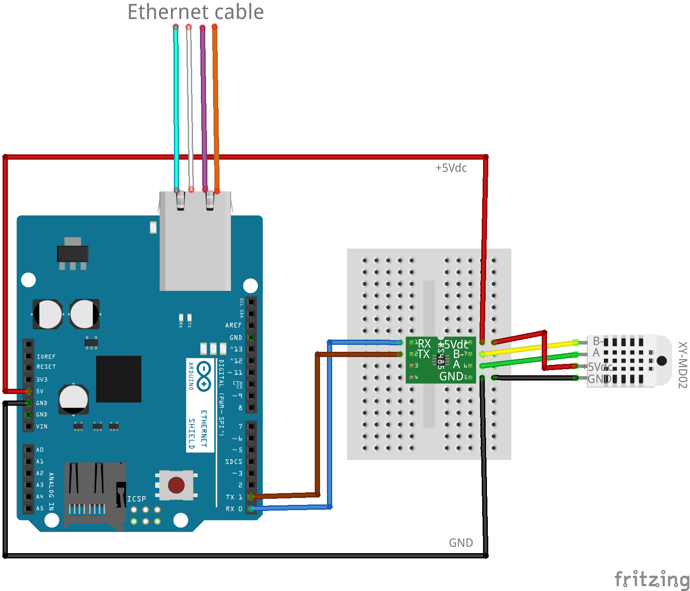
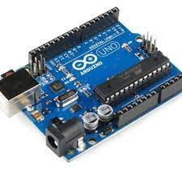
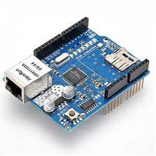
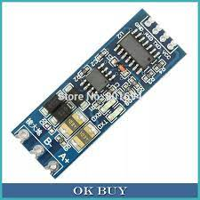
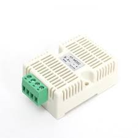

&nbsp;

AUBRY Marc

marco487160@gmail.com

Skype: marcomy

WA +628126637609

ArduinoUno/EthernetShield XY-MD02 UDP Sensor

July&nbsp;16, 2021
<h1 class="c31" id="h.rrar1dgps27e">Overview</h1>
Building a sensor based on Arduino Uno MCU&nbsp;controller board with it&rsquo;s attached Arduino Ethernet shield&nbsp;to connect an XY-MD02 sensor&nbsp;to an UDP server&nbsp;via a dedicated UDP port. The XY-MD02 sensor is connected to the arduino uno board via a RS485 serial interface. The RS 485 serial interface is based on a MAX-485 chip. The Arduino Uno is providing the +5Vdc VCC and GND to both the R485 module and the sensor. It is only for the testing and development of the sensor.  In a real case deployment the power supply of the XY-MD02 sensor is going to be a separated power supply. The two system Arduino and XY-MD02 doesn&rsquo;t need to be grounded together and a two wire twisted cable is enough to ensure the serial communication up to 800m.  For the ease of testing and development we will use only one VCC and one Ground to power the all system. The XY-MD02 sensor can use either the standard modbus serial&nbsp;protocol or a standard serial UART protocol. Because the sensor is not meant to be used in an array of sensors connected to the same RS485 two wire bus, it is much easier to communicate with the sensor using a simple text UART serial protocol. 

<h1 class="c31" id="h.bpcrqomjvo3i">Schematic:</h1>

<h1 class="c31 c39" id="h.7e8jqz7ch9sa"></h1><h1 class="c31" id="h.kv6xg9j71xqk">Hardware requirement:</h1><ul class="c45 lst-kix_ksyxq9482q2b-0 start"><li class="c22 li-bullet-0">Arduino Uno </li><li class="c22 li-bullet-0">Arduino Ethernet shield</li><li class="c22 li-bullet-0">Serial TTL To RS485 Module Converter Auto flow control MAX485 </li><li class="c22 li-bullet-0">XY-MD002 sensor: </li></ul>

<h2 class="c24" id="h.3of0y6flfniu">Remarks about the Serial TTL To RS485 Module Converter Auto flow control MAX485 module:</h2>
This module is easier to use compared to a normal MAX485 module because of its Auto flow control. It needs only one RX and One TX&nbsp;connection to directly communicate through RS485 lines. Conventional MAX 485 uses two more lines to be able to communicate through the RS485 communication line. It needs one driver enable line (high enable) and one Receiver enable line (Low enable) These two lines are normally used to select the sending or receiving mode of the RS485 protocol. Rs 485 is not full duplex and this line allows you to select which mode the module is in.  With the Auto flow control of the MAX485, the module itself takes care of this part of the communication, simplifying the programmation.  However I did not try to use the Modbus RS485 protocol with the auto flow control capability and further testing must be performed to validate it.

The silk screen printing on the module uses unconventional RX and TX labeling, therefore the TX&nbsp;of the module must be connected to the TX&nbsp;of the arduino and the RX&nbsp;of the module must be connected to the RX&nbsp;of the arduino.

The two wires of the RS485 line must be twisted to work properly for a long distance.
<h2 class="c24" id="h.8x8356mrozjh">Remarks about the Arduino Uno UART:</h2>
RS485 protocol is working only on physical UART&nbsp;and Software serial&nbsp;library can&rsquo;t be used&nbsp;with the RS485 communication protocol. The Arduino Uno got only one physical UART connected to the pin0 and 1. It&rsquo;s the same port which is used for the USB upload and the serial monitor. Therefore each time you want to upload the code from the Arduino IDE via the USB port you must disconnect the sensor from the RX/TX pins of the board otherwise the upload will fail. The Arduino serial monitor can&rsquo;t be used simultaneously with the RS485 module connected to the RX/TX pin of the Arduino board. If you want to avoid this problem you should upgrade your board to an Arduino Mega which offers 4 physical serial ports on 8 different pins.

<h1 class="c46" id="h.obvgg5qzha7v">The code:</h1><table class="c44"><tbody><tr class="c27"><td class="c47" colspan="1" rowspan="1">
#include&nbsp;&lt;Ethernet.h&gt; #include&nbsp;&lt;EthernetUdp.h&gt;  // Enter a MAC address and IP address for your controller below. byte&nbsp;mac[] = {  &nbsp;0xDE, 0xAD, 0xBE, 0xEF, 0xFE, 0xED }; IPAddress&nbsp;ip(192, 168, 1, 177);  unsigned&nbsp;int&nbsp;udpPort = 8888; &nbsp; &nbsp; &nbsp;// Your UDP port //char udpServer[]=&quot;myUDPserver&quot;; // uncomment for network name instead of ip address byte&nbsp; udpServer[4]={192,168,1,61};// uncomment for IP address instead of network name  // buffers for receiving and sending data char&nbsp;packetBuffer[UDP_TX_PACKET_MAX_SIZE]; &nbsp;// buffer to hold incoming packet, char&nbsp;ReplyBuffer[512] ; &nbsp; &nbsp; &nbsp; &nbsp;// a string to send back  // Sample rate in ms unsigned&nbsp;int&nbsp;samplerate=3000; unsigned&nbsp;long&nbsp;timer=0; //sampling rate timer // Start EthernetUDP instance to let us send and receive packets over UDP EthernetUDP&nbsp;Udp;  void&nbsp;setup() {  &nbsp;//Starting Ethernet interface  &nbsp;Ethernet.init(10); &nbsp;  &nbsp;Ethernet.begin(mac, ip);   &nbsp;// Open serial communications and wait for port to open:  &nbsp;Serial.begin(9600);  &nbsp;while&nbsp;(!Serial) {  &nbsp; &nbsp;  &nbsp;}  &nbsp;// Check for Ethernet hardware present  &nbsp;if&nbsp;(Ethernet.hardwareStatus() == EthernetNoHardware) {  &nbsp; &nbsp;while&nbsp;(true) {  &nbsp; &nbsp; &nbsp;delay(1); // do nothing, no point running without Ethernet hardware  &nbsp; &nbsp;}  &nbsp;}   &nbsp;// start UDP  &nbsp;Udp.begin(udpPort);  &nbsp;//Change the following to change the initialization string to be send to the sensor  &nbsp;//Serial.print (&quot;HZ:1&quot;); //Temperature and Humiditye reporting rates in Hx (0.5,1,2,5,10)  &nbsp;  &nbsp;//start sampling rate timer  &nbsp;timer=millis();  &nbsp; }  void&nbsp;loop() {  &nbsp;//Read incoming string from the sensor  &nbsp;if&nbsp;(Serial.available() &gt; 0) {  &nbsp; &nbsp;String&nbsp;SerialIn = Serial.readString();  &nbsp; &nbsp;SerialIn.toCharArray(ReplyBuffer, 512);  &nbsp; &nbsp;Udp.beginPacket(udpServer, udpPort);  &nbsp; &nbsp;Udp.write(ReplyBuffer);  &nbsp; &nbsp;Udp.endPacket();  &nbsp;}  &nbsp;//Samplingrate timer  &nbsp;if&nbsp;(millis()-timer &gt;=samplerate){  &nbsp; &nbsp;Serial.println(&quot;READ&quot;); //send the READ command to the sensor  &nbsp; &nbsp;timer=millis();  &nbsp;}  }
</td></tr></tbody></table>

<h1 class="c46" id="h.osb25ed343jp">Before uploading the code:</h1>
Before uploading the code please modify the following to match your configuration:
<h2 class="c24" id="h.1mjdwzulfsu3">Mac Address:</h2>
If you need a specific MAC address due to your firewall restriction please modify the following: byte&nbsp;mac[] = {  &nbsp;0xDE, 0xAD, 0xBE, 0xEF, 0xFE, 0xED };
<h2 class="c2" id="h.z4k73q53zogc">IP address:</h2>
Modify the following to match your network requirement IPAddress&nbsp;ip(192, 168, 1, 177); 
<h2 class="c2" id="h.r3cc4yq8cb2h">UDP server port:</h2>
Modify the following to match your UDP server listening port 

unsigned&nbsp;int&nbsp;udpPort = 8888; &nbsp; &nbsp; &nbsp;// Your UDP port

<h2 class="c2" id="h.c6ep933rzdj9">UDP server port or lan address :</h2>
If you want to use network name UNC instead of ip address, uncomment the following 

//char udpServer[]=&quot;myUDPserver&quot;; 

and replace &ldquo;myUDPserver&rdquo; by your server name and comment the following line

byte&nbsp; udpServer[4]={192,168,1,61};

If you want to use IP address instead of network name keep the following commented:  //char udpServer[]=&quot;myUDPserver&quot;;

And change the following to match your UDP server port. byte&nbsp; udpServer[4]={192,168,1,61};

<h2 class="c2" id="h.1truqxu2kxss">Sampling rate:</h2>
Modify the following to match your sampling rate needed: unsigned&nbsp;int&nbsp;samplerate=3000; The sampling rate is in milliseconds. 3000 = one reading every 3s.

<h1 class="c2" id="h.xtp2kblsomn4">Uploading the code:</h1>
Before uploading the code select the proper board and port in the Arduino IDE software by selecting Tools/Board/Arduino Uno And Tools/Port/ &ldquo;YourCom port&rdquo;

Remember to disconnect the sensor for TX/RX (pin 0 and 1) from the arduino before uploading via the USB port otherwise the upload will fail.

Once the upload is successful, disconnect the USB port and reconnect the TX/RX pin to the RS485 module. To start the sensor just plug the USB port to power the system. 
<h1 class="c31" id="h.7lveysbkakv5">Reading the datas:</h1>
Once the system is powered from the USB port, the sensor will send to your UDP server on the selected UDP port a string containing the data every sample rate defined in the samplerate&nbsp;variable. The string is formatted as follow: &ldquo;XX.X&deg;C,YY.Y%&rdquo; followed by the character &ldquo;CRLF&rdquo; (Carriage line feed} Where XX.X&nbsp;is the temperature id degre celsius and YY.Y&nbsp;is the humidity in percent. The temperature and humidity are a 1 digit float from 0.0 to 99.9. A &ldquo;,&rdquo; (comma character) is used to split the two measurement
<h2 class="c24 c36" id="h.vpj9i7ku9g3a"> Remark:</h2>
The character &ldquo;&deg;&rdquo; is not a regular character and is depending on the ASCII table used by your system. The ASCII code of &ldquo;&deg;&rdquo; should be alt 248. It is possible that your system read the following string instead: &rdquo;27.8&#65533;&#65533;,72.6%&rdquo; Nevertheless the string format will be always the same: [Digit] [Digit] [dot] [Digit] [Char] [Char] [Comma] [Digit] [Digit] [Dot] [Digit] [Char]

<h1 class="c31" id="h.i1tacyp0zck0">String command available for the XY-MD02 sensor:</h1>
You can send the following command to the sensor using a simple Serial.print(&quot;COMMAND&quot;)

Example: Serial.print(&quot;READ&quot;)&nbsp;will read the data from the sensor.

The following command are available:

READ : Read temperature and humidity AUTO: start the temperature and humidity automatic report function STOP: start the temperature and humidity automatic report function This two function allow you to read the data between the start and stop command and the data will be sent at once after receiving the stop command according to the frequency rate define by the command HZ (see below) BR:XXXX&nbsp;Set the baud rate between 9600 and 19200 TC:XX.X&nbsp;set the temperature calibration (-10.0 to 10.0) HC:XX.X set the humidity calibration (-10.0 to 10.0) HZ:XXX&nbsp;set the temperature humidity reporting rate (0.5, 1, 2, 5 ,10) PARAM&nbsp;Read the system current set value
<h2 class="c24 c36" id="h.2p15d4lqhpcs">Sensor UART serial port default setup:</h2>
By default the UART of the sensor is set to: Baud rate: 9600 Bit:&nbsp;8 Stop bit: 1 Check bit: No 

</body></html>
